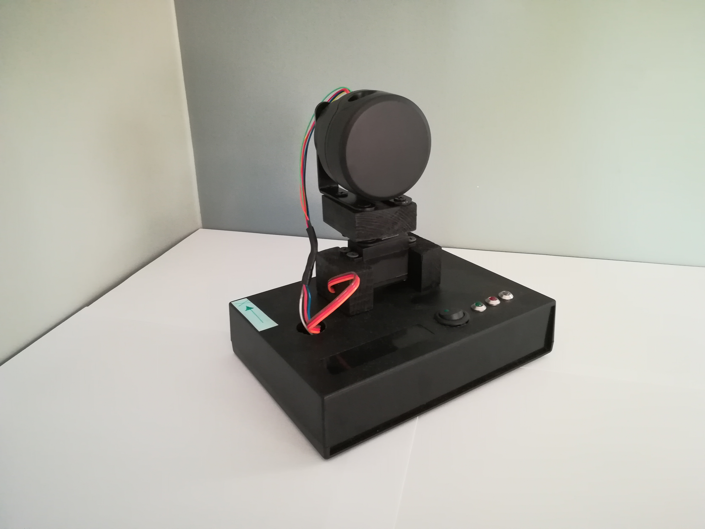
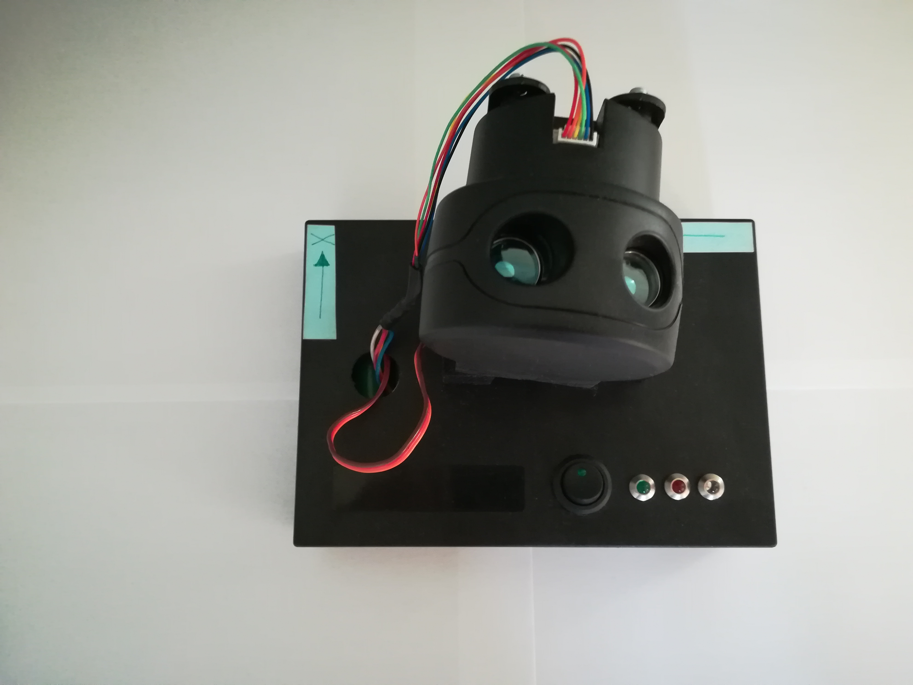

# Indoor environment mapping
> Analysis of environment mapping by using ICP algorithm and orginal 3D scanner with LiDAR sesnor.

## Table of contents
* [General info](#general-info)
* [Technologies](#technologies)
* [Functionality](#functionality)
* [Screenshots](#screenshots)
* [Features](#features)
* [Status](#status)
* [Contact](#contact)

## General info
Research project, whose aim was to construct and make a 3D scanner, allowing to make room maps in the form of a point cloud. 
The project was implemented based on the Arduino microcontroller, rotary lidar. 

Performing a series of measurements, tests and attempts were made to combine many scans into one complete map.

The device using the serial port sent data to the computer, where the Matlab script was responsible for processing and saving them in the appropriate format. Data in the form of a point cloud were pre-filtered, and then a series of studies were performed using the ICP algorithm. The tests were carried out in the living room and the Physics Building of the Warsaw University of Technology. The latter brought interesting results. 15 measurements were combined to obtain a full image of the 25m x 23m x 10m auditorium. The effects of the work are presented in the [Screenshots](#screenshots) section.

## Technologies
* Matlab 2018b
* Computer Vision Matlab Toolbox
* ICP algorithm
* Arduino (Arduino MEGA)

## Screenshots

## Features
* Maximum number of points in the single scan point cloud: around 97,000
* Measurement time: 2-4 min (depending on resolution)
* Full map of the room

## Status
Project is: _finished_

## Contact
Created by [@zielinp](https://www.linkedin.com/in/zielinp/) - feel free to contact me!
